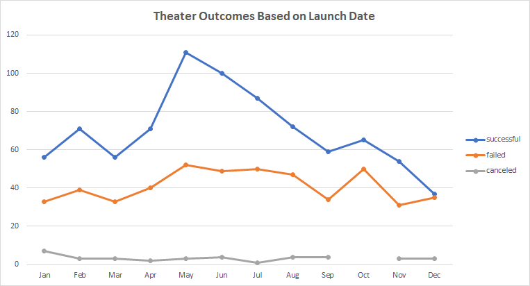
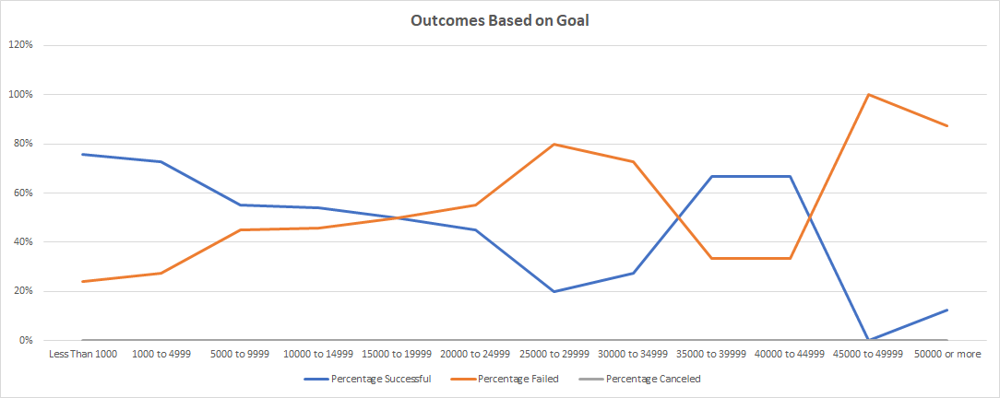

# kickstarter-analysis

## Overview of Project

  This [project](Kickstarter_Challenge.xlsx) uses excel to analyze kickstarter data taken from May 2009 to March 2017. The data includes various types of projects coming from a range of different countries. With 4,114 entries in the project, we have a credible subset of data to make reasonable recommendations from. With this data we will look at their goals and how much money that got pledged. We will categorize projects based on their ability to meet the goal they set

### Purpose

  The purpose of this analysis is to help Louise compare how her new play, *Fever*, performed compared to other kickestarters in the past. With this in mind, we will focus on 2 main factors. 

  - When should the kickstarter be launched in order to generate the most pledge money for the project?
  - What goal level leads to the most successful campaigns?

  With these goals, we can create a project that we can be confident will succeed in reaching the required funds.

## Analysis and Challenges

This analysis will use the features of excel to generate charts and help us reach a conclusion. The main focus of the analysis is the outcome of the projects, whether the kickstarter was successful or failed. We will look at two specific factors that play an important impact on the outcome. 

- The first factor we will look at is the outcome of campaigns based on the month the kickstarter was launched. 
- The second factor we will look at is how the kickstarter projects fared based on the goal they set for themselves.

### Analysis of Outcomes Based on Launch Date

For this section of the analysis we utilized excel's *pivot table* feature to organize and view data. Kickestarters were filtered to only show us projects that involved theater. Arranging the pivot table, we then looked at outcomes based on the month they were launched. Using this pivot table, we created the line chart seen above with the data.

**Key Points**
- Most kickstarters launched in May with 166 total projects. 
- May also features the largest gap between failed and successful kickstarters (52 vs 111), with the gap steadily decreasing after that. 
- December is the only month where failed and successful kick starters are almost even.

### Analysis of Outcomes Based on Goals

The Goals vs Outcomes section utilizes excel formulas to find the percent of outcomes based on a range of goals. The 1st formula used was the `COUNTIFS()` Function.

With this function we filtered data based on outcome, lower bound of goals, upper bound of goals, and only pulled data involving plays. Once the type of outcome was found for each range, we utilized the `SUM()` function to find the total number of projects in each goal range. From there we found the percent of outcomes that were a certain type using `Outcome/Total` for each type of outcome. Please note that each percent is taken with respect to the total number of projects in each goal range and not the grand total.

**Key Points**
- Successful campaigns show a slight trend downward, although it's not consistent for every range of goals. a larger sample size may be needed to make a conclusion.
- $25,000 to $35,000 and $45,000+ all had a higher percentage of failed campaigns than successful ones.
- The highest success rate was for projects with a goal of less than $1,000.

### Challenges and Difficulties Encountered
The main challenge with this analysis was the spread of data. While there was a good amount of data over all, when looking at our analysis focused on plays, a majority of the data fell into one range of goals. redefining the goal brackets could help alleviate this and allow for a more conclussive analysis to take place. as is, a lot of the larger goals didnt have as many entries causing the data to vary in a way that could be inconclusive to the over all population.
 ## Results

- What are two conclusions you can draw about the Outcomes based on Launch Date?

  - from what we see in the chart, it is safe to conclude that launching a theater kickstarter in May offers the highest chance for success ( compared to other months of the year. Any project launched during the summer has a good chance to succeed.
  - December is the riskiest month to start a campaign in. Out of all the months that we see on the chart, December is the only month with a close to 50% success rate.

- What can you conclude about the Outcomes based on Goals?
  - My conclusion for the goal section is that the most successful campaigns are those with a goal under $15,000 with the absolute best being $1,000 to $4,999. These kickstarters had more successes than failures, which is a good sign. $1,000 to $4,999 had a good success rate and good value with the higher goals being a lot closer to 50%. While $35,000 to $44,999 had a positive success rate, there is not enough kickstarters overall to say that it is a trend for the data.

- What are some limitations of this dataset?

  - The greatest limit to the data is the lack of external factors in the data that may influence the results of a successful kickstarter. Types of data left out include ones that show if the kickstarter was ever trending, was it featured on the front page of Kickstarter and for how long, and what social media the project was promoted on. To aid this, one type of data I would pull is how many views a kickstarter project got. With this piece of data we can look at what percent of viewers choose to back a given campaign, how popular the campaign was in drawing people in, and when people are looking for kickstarter projects the most.

- What are some other possible tables and/or graphs that we could create?
   - One possible table i would want to look at is the relationship between the number of backers and outcomes. How many backers does it take to create a successful kickstarter campaign.
  -  Another graph I would like to look at is the Outcome vs launch date graph with years added on. Being able to see if there is an increase in successful campaigns over the years as Kickstarter grew and became more well known would be great. 
  -  The final graph, which is a step up from the last, would look at successful campaigns as a percent of the total campaigns vs as a percent of monthly campaigns. Most people have limited funds and seeing how competition affects the outcome is an important metric.
